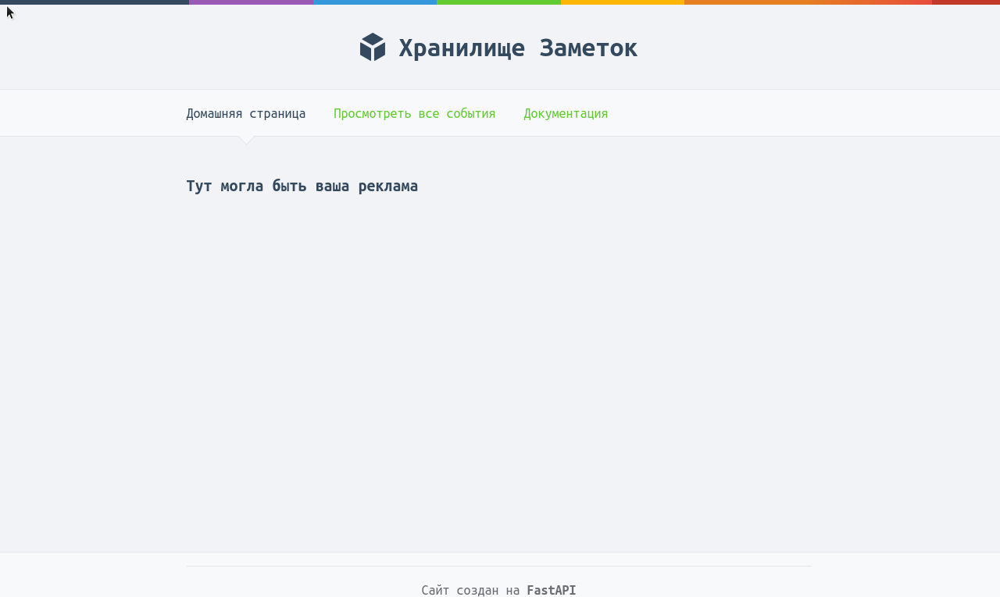
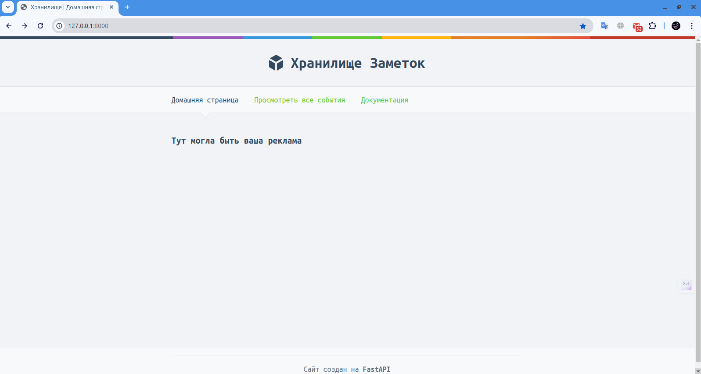
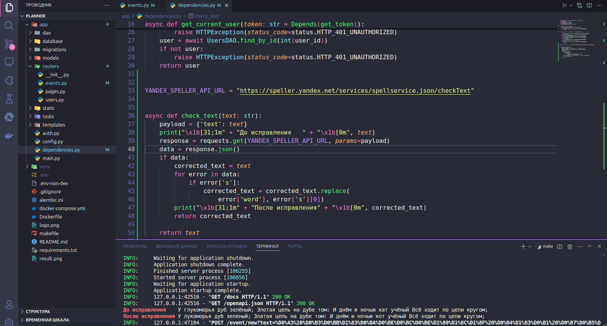

# :bookmark_tabs: Notice

## :pager: Стэк
- **Python**
- **FastAPI**
- **Postgresql**
- **SQLAlchemy**

### Тестовое задание для Стажёр-разработчик Python (KODE)

Нажмите, чтобы посмотреть подробности

### Описание:
Необходимо спроектировать и реализовать на Python сервис,
предоставляющий REST API интерфейс с методами
### Функциональные требования:
- Добавление заметки
- Вывод списка заметок
  
Данные необходимо хранить либо в текстовом файле (в формате json, либо csv), либо в базе данных (PostgreSQL или MongoDB). При сохранении заметок необходимо орфографические ошибки валидировать при помощи сервиса Яндекс.Спеллер (добавить интеграцию с сервисом). Также необходимо реализовать аутентификацию и авторизацию. Пользователи должны иметь доступ только к своим заметкам. Возможность регистрации не обязательна, допустимо иметь предустановленный набор пользователей (механизм хранения учетных записей любой, вплоть до hardcode в приложении).

### Требования к проекту:
- Для реализации сервиса использовать язык программирования Python (версии 3.9 и выше)
- Сервис должен работать через REST API, для передачи данных
использовать формат json
- Для реализации web-сервера рекомендуется использовать любой
асинхронный web-фреймворк (примеры: aiohttp, fastapi, starlette)
- В коде должны быть корректно проставлены type hint’ы
- Желательно использовать средства автоматизированного
форматирования исходного кода (yapf или black)
- Запуск сервиса и требуемой им инфраструктуры должен
производиться в докер контейнера
- Желательно продумать удобство проверки работоспособности методов
API при ревью задачи (шаблоны curl запросов, postman коллекция,
тесты и т.п.)

## Установка

 
### 1) Из директории, где расположен файл Dockerfile, выполните команду 
    docker compose up --build

### 2) Перейти по адресу
     http://127.0.0.1:8000

### 3) Перейти во вкладку "Документация". Зарегистрироваться и авторизоваться.

### Результат работы Яндекс Спеллер

<!-- 

    

<h2 align="center">Digital Resume</h2>

[Сайт](http://olegremizoff.pythonanywhere.com/)

Blog на Flask 2.2.2 -->
